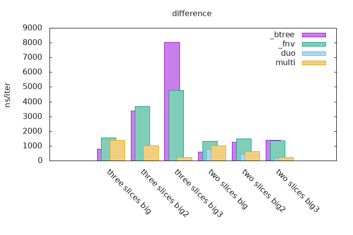
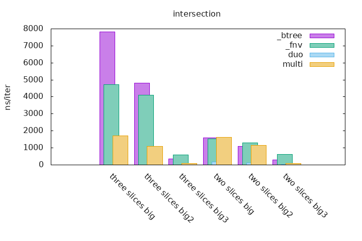

# sdset

Set theory applied on sorted and deduplicated slices. Much performance! Such Wow!

[Documentation](https://docs.rs/sdset) can be found on docs.rs.

`sdset` stands for `sorted-deduplicated-slices-set` which is a little bit too long.

## Performances

Note about the tests, which are done on ranges of integer, if it ends with:
  - `two_slices_big`, the first slice contains `0..100` and the second has `1..101`
  - `two_slices_big2`, the first contains `0..100`, the second has `51..151`
  - `two_slices_big3`, the first contains `0..100` and the second has `100..200`
  - `three_slices_big`, the first contains `0..100`,the second has `1..101` and the third has `2..102`
  - `three_slices_big2`, the first contains `0..100`, the second has `34..134` and the third has `67..167`
  - `three_slices_big3`, the first contains `0..100`, the second has `100..200` and the third has `200..300`

These slices of ranges of integer are useful when they overlap, we can see how performances changes on different overlap slices parts.

To run the benchmarks you must enable the `unstable` feature.

```bash
$ cargo bench --features unstable
```

#### Histograms

Histograms can be generated using the benchmarks by executing the following command:

```bash
$ export CARGO_BENCH_CMD='cargo bench --features unstable'
$ ./gen_graphs.sh
```

This is much more easier to read statistics and to see how `sdset` is more performant on already sorted and deduplicated slices than any other kind of collection.

Note that the `sdset` set operations does not need many allocations so it starts with a serious advantage. For more information you can see the variance when running benchmarks.

`btree` stands for *two* or *three* (see above) `BTreeSet`s which contains runs of integers. The set operation is done on these sets and the final iterator is just iterated over using `Iterator::for_each()`.

`vec` benchmarks are available for the union set operation only, it consist of a `Vec` which is populated with the elements of *two* or *three* slices (see above), sorted and deduplicated.

`duo` and `multi` are the implementations that are part of this crate, the first one can only do set operations on **two** sets and the second one can be used for any given number of sets.





