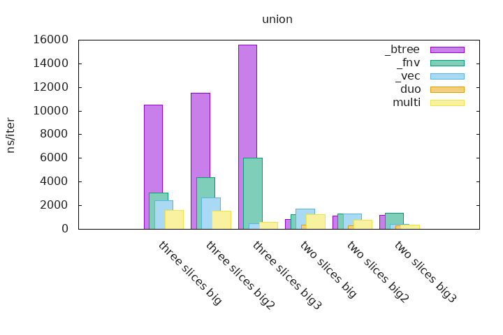

# SdSet

[](https://crates.io/crates/sdset)
[](https://docs.rs/sdset)

Set theory applied on sorted and deduplicated slices. Much performance! Such Wow!

[API Documentation can be found on docs.rs](https://docs.rs/sdset).

`sdset` stands for `sorted-deduplicated-slices-set` which is a little bit too long.

## Performances

Note about the tests, which are done on ranges of integer, if it ends with:
  - `two_slices_big`, the first slice contains `0..100` and the second has `1..101`
  - `two_slices_big2`, the first contains `0..100` and the second has `51..151`
  - `two_slices_big3`, the first contains `0..100` and the second has `100..200`
  - `three_slices_big`, the first contains `0..100`, the second has `1..101` and the third has `2..102`
  - `three_slices_big2`, the first contains `0..100`, the second has `34..134` and the third has `67..167`
  - `three_slices_big3`, the first contains `0..100`, the second has `100..200` and the third has `200..300`

These slices of runs of integer are useful when they overlap, we can see how performances changes when different parts of the slices overlaps.

To run the benchmarks you must enable the `unstable` feature.

```bash
$ cargo bench --features unstable
```

Note that the `sdset` set operations does not need many allocations so it starts with a serious advantage. For more information you can see the benchmarks variance.

`btree` are benchmarks that uses *two* or *three* `BTreeSet`s which contains runs of integers (see above), the `BTreeSet`s creations are not taken into account. The set operations are done on these sets and the result is accumulated in a final `Vec`.

The `vec` benchmarks are available for the union set operation only, it consist of a `Vec` which is populated with the elements of *two* or *three* slices (see above), sorted and deduplicated.

The `duo` and `multi` measurements are the implementations that are part of this crate, the first one can only do set operations on **two** sets and the second one can be used for any given number of sets.

### Histograms

Histograms can be generated using the benchmarks by executing the following command:

```bash
$ export CARGO_BENCH_CMD='cargo bench --features unstable'
$ ./gen_graphs.sh
```

This is much more easier to read statistics and to see how `sdset` is more performant on already sorted and deduplicated slices than any other kind of collection.



